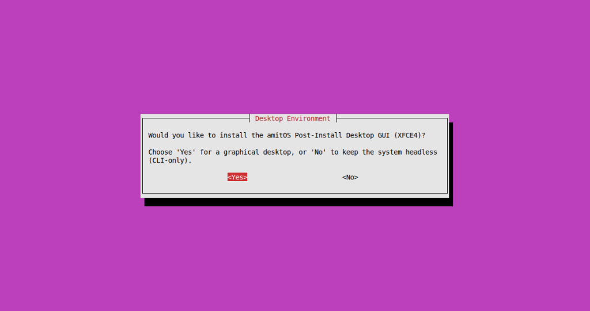
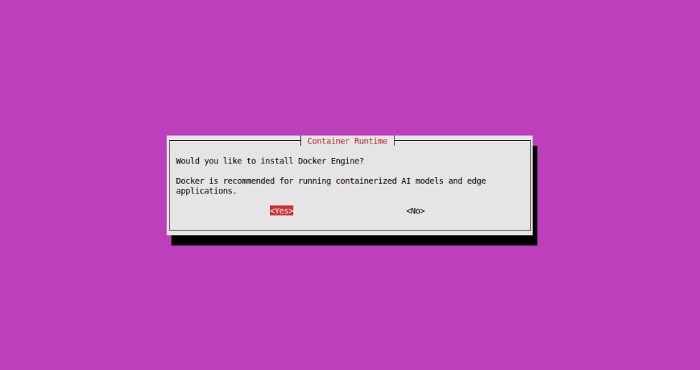
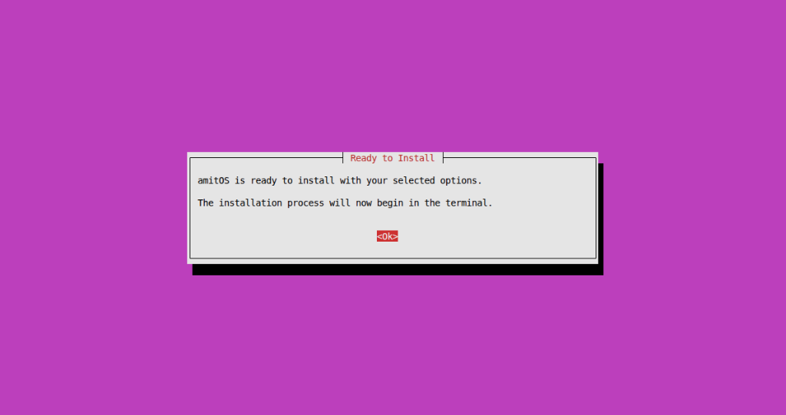
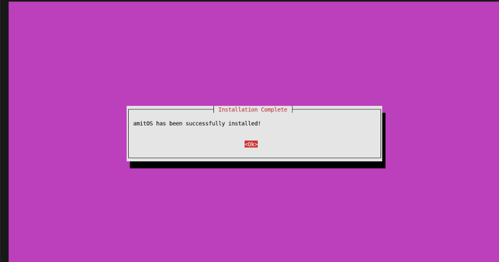

<div align="center">


# amitOS

**Industrial Automation OS · Edge AI · GPU-Powered**

[](LICENSE)
[](https://www.debian.org/)
[](docs/AI_GPU.md)
[](CONTRIBUTING.md)

</div>

---

**amitOS** is a lightweight, secure, and AI-enabled operating system built specifically for **industrial automation and edge computing**. Powered by a hardened **Debian core** with a custom-tuned kernel, amitOS brings simplicity, performance, and intelligence to modern industrial systems.

## 🚀 Key Features

### 🔌 Industrial Protocols – Native
- ✅ **OPC UA & OPC DA** support out-of-the-box
- ✅ Auto-discovery, client/server support
- ✅ Real-time data handling for SCADA & PLC systems

### 🌐 Optimized Networking Stack
- 🧠 Built-in support for **Netplan** for intuitive network configuration
- 🔒 Secure-by-default with **Nginx** reverse proxy and TLS certificate tools
- 🔗 Adapter-based system integration

### 🤖 AI-Ready & GPU-Accelerated
- Pre-installed Python + ONNX + TensorFlow Lite
- **Full CUDA support** for NVIDIA GPUs
- Integrated support for:
  - PyTorch (with CUDA acceleration)
  - TensorFlow-GPU
  - OpenCV with CUDA modules
  - cuDNN and NCCL
- Docker & container-native development support
- Simple runtime environment for deploying AI on the edge

### 🖥️ User Experience & Desktop GUI
- **GUI Installer Setup Wizard** for a frictionless installation experience
- **Post-Installation Desktop GUI** (XFCE4) available via `--desktop` flag
- Headless options still fully supported for minimal edge deployments

### 💽 amitFS — Universal Filesystem
- Built-in **amitFS framework** supporting ALL major filesystems seamlessly:
  - Linux (EXT4, BTRFS, XFS)
  - Windows & Removables (NTFS3, FAT32, exFAT)
  - Flash-optimized (F2FS)
- Time-series optimized for high-speed industrial data logging

### 🔄 Adapter Framework
Comes bundled with **5+ plug-and-play adapters**, including:
- Modbus
- MQTT
- Siemens S7
- BACnet
- REST API Bridge

### 🔐 Security & Control
- Built-in firewall and VLAN support
- Reverse proxy configuration via Nginx GUI
- Remote diagnostics, OTA updates (Pro license)

---

## 🧰 System Requirements

| Component         | Minimum Requirement         |
|------------------|-----------------------------|
| CPU              | x86_64 or ARMv8             |
| RAM              | 2 GB                        |
| Storage          | 8 GB (SSD recommended)      |
| GPU (Optional)   | NVIDIA GPU with CUDA 11+    |
| Network          | Ethernet or Wi-Fi           |

---

## 💼 Licensing

- 🔓 **Community Edition**: Free to use for learning, testing, and PoCs
- 💼 **Pro License** (Coming Soon):
  - Advanced security tools
  - OTA updates and remote diagnostics
  - Commercial support
  - Adapter marketplace access

---

## 📦 Installation

amitOS provides both a visual setup wizard and a headless installer.

**Option 1: GUI Setup Wizard (Recommended)**
```bash
git clone https://github.com/yourusername/amitos.git
cd amitos
sudo ./gui-installer.sh
```
*Screenshots of the setup wizard:*
<div align="center">
  
  
  
  
</div>

<br>

**Option 2: Headless Installation (Advanced)**
```bash
git clone https://github.com/yourusername/amitos.git
cd amitos
sudo bash install.sh --desktop 
```

## 🛠️ Roadmap
 Debian-based Core OS

 OPC UA/DA stack integration

 Netplan & Nginx built-in

 CUDA support and GPU-ready libraries

 Modular Adapter SDK

 Web-based system dashboard

 OTA update system

## 🤝 Contributing
We welcome contributions from developers, engineers, and system integrators. Please check out the CONTRIBUTING.md file for details.

## 📧 Contact
Project Lead: ashutoshPandey https://linkedin.com/in/ashutosh12

Email: ashutoshpandeyies@gmail.com

## 📜 License
This project is licensed under the MIT License – see the LICENSE file for details.

## ⚡ amitos | Built for Industry 4.0 | GPU-Powered | AI on the Edge | Secured by Debian